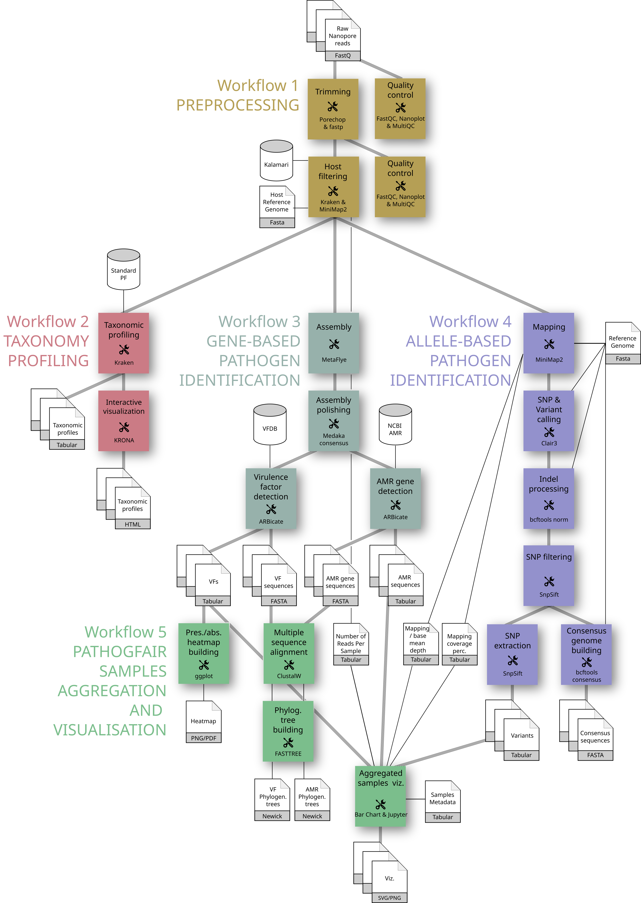

# PathoGFAIR: Galaxy FAIR and Adaptable Workflows for Pathogen Detection, Tracking and Samples Comparison

## Overview

Welcome to the GitHub repository for the Foodborne Pathogen Detection and Tracking Project under the fund of [EOSC life industry call 2021](https://www.eosc-life.eu/industrycall/). This project aims to provide a comprehensive solution for the identification and tracking of (foodborne) pathogens using metagenomic (Nanopore) sequencing data. The workflows are developed using Galaxy, an open-source platform for FAIR data analysis.

## How to find PathoGFAIR Workflows

| Workflow Name | WorkflowHub | Dockstore | Galaxy Servers |
|---------------|-------------|-----------|----------------|
| Nanopore **Preprocessing**  (v 0.1)  | [ID 1061 v 0.1](https://workflowhub.eu/workflows/1061) | [nanopore-pre-processing/main:v0.1](https://dockstore.org/workflows/github.com/iwc-workflows/nanopore-pre-processing/main) | [European Galaxy Server](https://usegalaxy.eu/published/workflow?id=a705370bc2c13d5c), [United States Galaxy Server](https://usegalaxy.org/published/workflow?id=574e42683dc3961b), [Australian Galaxy Server](https://usegalaxy.org.au/published/workflow?id=25d52afddaa3451b) |
| **Taxonomy Profiling** and Visualization with Krona  (v 0.1)  | [ID 1059 v 0.1](https://workflowhub.eu/workflows/1059) | [taxonomy-profiling-and-visualization-with-krona/main:v0.1](https://dockstore.org/workflows/github.com/iwc-workflows/taxonomy-profiling-and-visualization-with-krona/main) | [European Galaxy Server](https://usegalaxy.eu/published/workflow?id=10101558b211a782), [United States Galaxy Server](https://usegalaxy.org/published/workflow?id=8f5904693b5f74f4), [Australian Galaxy Server](https://usegalaxy.org.au/published/workflow?id=d9ba165e6ae55417) |
| **Gene-based Pathogen Identification**  (v 0.1)  | [ID 1062 v 0.1](https://workflowhub.eu/workflows/1062) | [gene-based-pathogen-identification/main:v0.1](https://dockstore.org/workflows/github.com/iwc-workflows/gene-based-pathogen-identification/main) | [European Galaxy Server](https://usegalaxy.eu/published/workflow?id=585c21b7b1d864fc), [United States Galaxy Server](https://usegalaxy.org/published/workflow?id=cce88bc57b180d09), [Australian Galaxy Server](https://usegalaxy.org.au/published/workflow?id=ef8c22c2525063a2) |
| **Allele-based Pathogen Identification**  (v 0.1)  | [ID 1063 v 0.1](https://workflowhub.eu/workflows/1063) | [allele-based-pathogen-identification/main:v0.1](https://dockstore.org/workflows/github.com/iwc-workflows/allele-based-pathogen-identification/main) | [European Galaxy Server](https://usegalaxy.eu/published/workflow?id=09c7069ae409c362), [United States Galaxy Server](https://usegalaxy.org/published/workflow?id=38911ba6f66d80f6), [Australian Galaxy Server](https://usegalaxy.org.au/published/workflow?id=244ea5e94237ebad) |
| Pathogen Detection **PathoGFAIR Samples Aggregation and Visualisation**  (v 0.1)  | [ID 1060 v 0.1](https://workflowhub.eu/workflows/1060) | [pathogen-detection-pathogfair-samples-aggregation-and-visualisation/main:v0.1](https://dockstore.org/workflows/github.com/iwc-workflows/pathogen-detection-pathogfair-samples-aggregation-and-visualisation/main) | [European Galaxy Server](https://usegalaxy.eu/published/workflow?id=376119528377a3ae), [United States Galaxy Server](https://usegalaxy.org/published/workflow?id=2d3063882d8239ff), [Australian Galaxy Server](https://usegalaxy.org.au/published/workflow?id=eda40b58616a0fe4)|
| **PathoGFAIR** 5in1  (v 0.1)  | Soon | Soon | [European Galaxy Server](https://usegalaxy.eu/published/workflow?id=0dce37adb369492c), [United States Galaxy Server](https://usegalaxy.org/published/workflow?id=e55593af91337a05), [Australian Galaxy Server](https://usegalaxy.org.au/published/workflow?id=f5f9808fb50b6f2c)|

## Project Structure

- **Workflows:** The core of this project consists of a series of Galaxy-based workflows collectively known as PathoGFAIR. These workflows are designed to process Nanopore sequencing data, detect pathogens, and track their presence across samples. Workflows are available via the Galaxy Intergalactic Workflow Comission [IWC](https://dockstore.org/organizations/iwc)

	PathoGFAIR consists of 5 workflows that are created to be scalable to any other type of sequencing technique as well as agnostic such that it can detect all possible pathogens without specifying any pathogen species or giving any information about the input samples to the workflows. The 5 workflows are:

	- **Preprocessing**: where the quality controlling, reads trimming for quality retaining, host sequences removal and other contaminating sequences removal take place
	- **Taxonomy Profiling**: where taxonomy profiling takes place identifying and visualizing our samples' community abundances down to the subspecies level
	- **Gene-based Pathogen Identification**: where we identify all possible pathogens by identifying all the Virulence factors (VFs) genes and their specific locations, we also identify Antimicrobial resistance genes (AMRs) within the same workflow.
	- **Allele-based Pathogen Identification**: where we identify all the SNPs and variants and create the consensus sequences of all samples
	- **PathoGFAIR Samples Aggregation and Visualisation**: where we visualize the outputs of the pathogens drawing a heatmap of all the found pathogenic genes for all samples,  phylogenetic trees relating samples together per common pathogenic genes found, and bar charts for important tabular outputs of previous workflows, e.g. number of identified SNPs and variants per sample, number of removed host reads and mapping depth and coverage.

- **Training Material:** To assist users in understanding and using the workflows, we have provided extensive training material. This includes tutorials, documentation, and guidelines available via the Galaxy Training Network [GTN](https://bit.ly/pathogen-tuto).

- **Notebooks:** In this repository, you'll find Jupyter notebooks that utilize the output generated by the workflows. These notebooks are designed for reproducing paper-associated figures and allow users to produce similar extra figures other than the ones already included in workflow 2 and 5. The notebook is also designed to run on any Galaxy instance using Jupytool. 

## How to Run the Workflows

- **Galaxy Instance:** You can run the workflows on any Galaxy instance. The workflows are openly available on two workflow registries; WorkflowHub and Dockstore. You can directly use PathoGFAIR on the three main Galaxy servers; European, American, and Australian, or install it on any other Galaxy server.

- **Data Preparation:** Ensure your data is in the correct format and follows the specified guidelines. Please take a look at the training material for details on input requirements.

- **Workflow Execution:** Import the PathoGFAIR workflows into your Galaxy instance and follow the step-by-step instructions provided in the associated training material to execute the workflows on your data.

## [Repository](https://github.com/usegalaxy-eu/PathoGFAIR/tree/main) Contents

- **Jupter notebooks:** The [`bin`](https://github.com/usegalaxy-eu/PathoGFAIR/tree/main/bin) directory contains Jupyter notebooks for post-processing and visualization of workflow results.

- **Workflows output datasets:** The [`data`](https://github.com/usegalaxy-eu/PathoGFAIR/tree/main/data/galaxy_inputs) directory contains outputs of the workflows after running them on the paper-mentioned samples (BioProject PRJNA982679, BioProjects PRJNA942086 and PRJNA942088). The directory also includes the samples metadata.

- **Jupter notebooks results:** The [`results`](https://github.com/usegalaxy-eu/PathoGFAIR/tree/main/results) directory contains results after running the Jupyter notebooks on the workflows output datasets.

- **Publication figures:** The [`docs/figures`](https://github.com/usegalaxy-eu/PathoGFAIR/tree/main/docs/figures) directory contains all figures mentioned in the paper.

- **Publication tables:** The [`docs/tables`](https://github.com/usegalaxy-eu/PathoGFAIR/tree/main/docs/tables) directory contains all tables mentioned in the paper.

## Galaxy History

The [Galaxy history](https://usegalaxy.eu/u/engy.nasr/h/biolytix-datasets-analysis) includes the output of running PathoGFAIR workflows on 46 samples, sampled and sequenced by [Biolytix](https://www.biolytix.ch/en/).

## Benchmarking PathoGFAIR: Replication Guide

This section provides detailed instructions on replicating the PathoGFAIR benchmarking process, as outlined in our PathoGFAIR Benchmarking protocol on [protocols.io](). The focus here is on running the selected systems/pipelines used in our benchmarking.

### PathoGFAIR

- **Setup:**
	Access our created [Galaxy history](https://usegalaxy.eu/u/engy.nasr/h/biolytix-datasets-analysis), which contains the benchmarking results of PathoGFAIR

- **Results:**
	- View the results directly.
	- Rerun PathoGFAIR workflows on the same 46 samples, available under dataset number 47:biolytix_classified_samples.

### CZID (IDseq)

- **Setup:**
	1. Create an Account on [CZID](https://czid.org/): We used credentials from Engy Nasr, University of Freiburg.
	2. Create a public or private Project with the following details:
		- Name
		- Description
		- Analysis Type: Metagenomics
		- Sequencing Type: Nanopore
	3. Upload Datasets:
		Upload the 46 samples (total size: 7GB) either locally or from a public repository:
		- Local upload (our recommendation): Download the samples from our published [Galaxy history](https://usegalaxy.eu/u/engy.nasr/h/biolytix-datasets-analysis) and upload them.
		- Online upload: Use the NCBI repository PRJNA982679.
	4. Upload or Enter Metadata:
		Metadata fields we included are: host [Chicken], Ct value, sampling date, location, and nucleotide type [DNA], which are available in our metadata table in [`data/benchmark`](https://github.com/usegalaxy-eu/PathoGFAIR/tree/main/data/benchmark/PathoGFAIR_benchmark_Samples_metadata.tsv).
		- For a full list of possible fields to include, see: [CZID Metadata Dictionary](https://czid.org/metadata/dictionary).

- **Execution:**
	Sample uploads started on Tuesday, October 15th, at 9 AM. Dataset upload finished at 9:58 AM. Analysis was fully completed for all samples after: 1hour and 30 mins of the datasets finished upload.

- **Results:**
	View the analysis results: [CZID Results](https://czid.org/il2mk), use the drop down menu on the top left to switch between samples.

### BugSeq

- **Setup:**
	1. Create an Account on [BugSeq](https://app.bugseq.com/register): We used credentials from Engy Nasr, University of Freiburg.
	2. Upload datasets Upload the 46 samples (total size: 7GB) either locally or via their BaseSpace, that you have to contact them for. We uploaded them from local directory, same as explained for CZID(IDseq)
	3. Set up parameters
		- Platform: Nanopore
		- Device & Chemistry: MinION/GridION/Flongle - R9.4.1
		- Metagenomic Database: NCBI nt (BugSeq recommendation for metagenomics samples)
		- Sample Type: Generic (BugSeq recommendation)
		- Sequenced Material: DNA
		- Outbreak Analysis (Genomic Relatedness Visualization): yes

- **Execution:**
	Sample uploads started on Tuesday, October 15th, at 11:30 AM. Dataset upload finished at 12:30 PM. Analysis was fully completed for all samples after: 1hour and 30 mins of the datasets finished upload.

- **Results:**
	On Tuesday, October 15th, at 15:21 PM, we received that the analysis had failed, as we have insufficient sample credits.  We sent to their support for help directly after receiving their email. They replied back that we can only analyse 10 samples not 46, so BugSeq will be removed from the benchmark.

### Conclusion

By following these steps, you can replicate our benchmarking process and assess the performance of each system in detecting and identifying pathogens from metagenomic data. For additional details, refer to our published protocol on [protocols.io]() or explore the respective systems via the links provided in [`data/benchmark`](https://github.com/usegalaxy-eu/PathoGFAIR/tree/main/data/benchmark/PathoGFAIR_benchmark_Systems_tools_or_pipelines.tsv).

## Contributors

- [Engy Nasr](https://orcid.org/0000-0001-9047-4215)
- [Anna Henger](0009-0009-5853-8018)
- [Björn Grüning](https://orcid.org/0000-0002-3079-6586)
- [Paul Zierep](https://orcid.org/0000-0003-2982-388X)
- [Bérénice Batut](https://orcid.org/0000-0001-9852-1987)

## Citation

If you use or refer to this project in your research, please cite the associated paper: [PathoGFAIR: a series of FAIR and adaptable (meta)genomics workflows for (foodborne) pathogens detection and tracking].

Feel free to contribute, open issues, or provide feedback.
